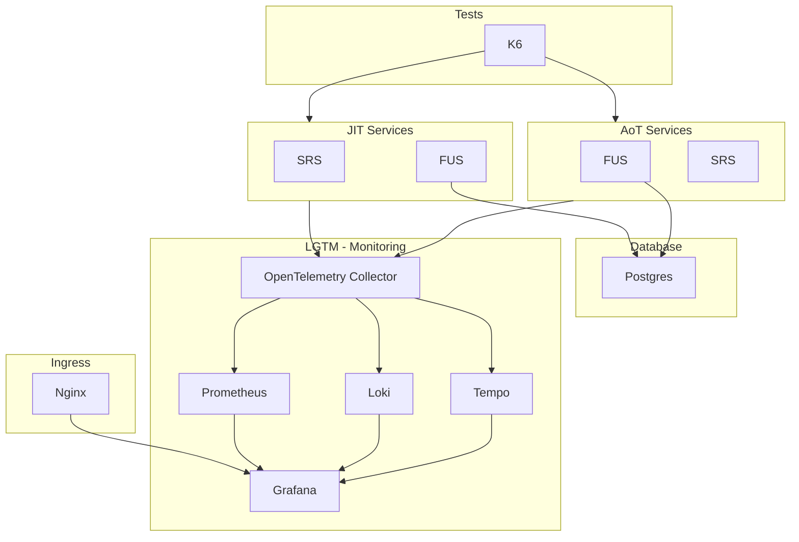

# DTA Stack

## Services

- LGTM (Liveness, Giveness, Traffic, Monitoring)
  - Prometheus
  - Grafana
  - Loki
  - Tempo
  - OpenTelemetry Collector
- Postgres
- Nginx
- DTA Services (JIT)
  - FUS
  - SRS
- DTA Services (AoT)
  - FUS
  - SRS

## Description

## Pre-requisites

## Usage

## Plugins

KNative

Kourier
